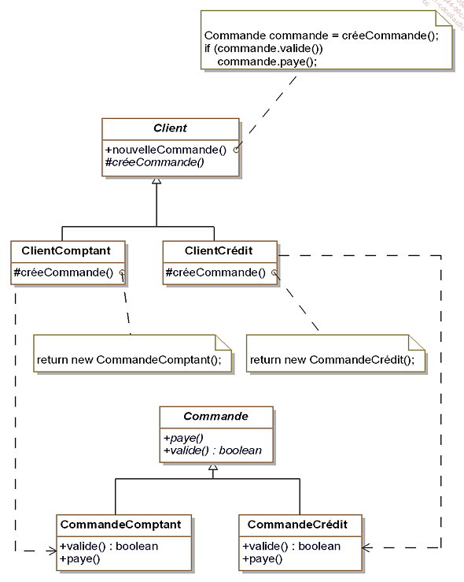

# 1) abstract factory 
 **Problématique** 
 A chaque fois qu'une nouvelle classe véhicule doit etre prise en compte, on doit modifier la classe mère.

 L'abstract factory résoud les problemes de creation de classe dont on ne connait pas le contenu final afin de déresponsabiliser la classe mère.
 Ici utilisation d'une interface qui comprend la signature des méthodes qui permettront de construire chaque produit et de sous-classes fabriqueVehiculeElectrique et fabriqueVehiculeEssence
*def signature = son nom, ses entrées et ses sorties*

### Diagrammes factory   


  
Description partie scooter : une classe abstraite Scooter, deux classes ScooterElectrique et ScooterEssence qui contiennent les parametres propres à chaque scooter. Pour créer un scooter on passe par ces deux classes filles.

Exemple implémentation :  
```
public abstract class Car {
    protected string model;
    protected string color;
    protected int power;
    protected int space;`
   
   
    protected Car(string model, string color, int power, int space)
    {
        this.model = model;
        this.color = color;
        this.power = power;
        this.space = space;
    }

    public abstract void displayFeatures();
}
 ------------------------------------------------------   

public class ElectricCar : Car
{
    public ElectricCar(string model, string color, int power, int space) : base(model, color, power, space)
    {
    }

    public override void displayFeatures()
    {
        Console.WriteLine("Electric car : ");
        Console.WriteLine("Model : "+model);
        Console.WriteLine("Color : "+color);
        Console.WriteLine("Power : "+power);
        Console.WriteLine("Space: "+space);
    }
}

--------------------------------------------------------  

public interface VehicleFactory {
    public Car buildCar(string model, string color, int power, double space);
    //can implement a second method buildScooter
}

--------------------------------------------------------  

public class ElectricVehicleFactory : VehicleFactory
{
    public Car buildCar(string model, string color, int power, double space)
    {
        return new ElectricCar(model, color, power, space);
    }

    //can implement a second method buildScooter that return an ElectricScooter
}

--------------------------------------------------------  

public class Catalogue {

    public static int vehicleNumber = 3;
    static void Main(string[] args) {
    VehicleFactory factory = new ElectricVehicleFactory();
        Car car = factory.buildCar("Tesla", "blue", 250, 2.5);
        car.displayFeatures();
    
    }
}
````

# 2) builder 
**Problématique**  
Créer un systeme capable de construire une liasse de documents.

But du builder : construire des objets complexes sans en connaitre leur implémentation/ayant plusieurs implémentations.


### Diagrammes builder   


  
NB: le Client ne discute qu'avec le builder de base pour séparer l'implémentation de la routine. 

Prenons ici l'exemple de gestion de liasse de documents, sans connaitre a nature du document.

```using System; 
using System.Collections.Generic; 
 
public abstract class Liasse 
{ 
 protected IList<string> contenu =  
     new List<string>(); 
 
 public abstract void ajouteDocument(string document); 
 public abstract void imprime(); 
} 
 
-------------------------------------------------------- 
using System; 
 
public class LiasseHtml : Liasse 
{ 
 public override void ajouteDocument(string document) 
 { 
   if (document.StartsWith("<HTML>")) 
     contenu.Add(document); 
 } 
 
 public override void imprime() 
 { 
   Console.WriteLine("Liasse HTML"); 
   foreach (string s in contenu) 
     Console.WriteLine(s); 
 } 
} 
 
--------------------------------------------------------
using System; 
 
public class LiassePdf : Liasse 
{ 
 public override void ajouteDocument(string document) 
 { 
   if (document.StartsWith("<PDF>")) 
     contenu.Add(document); 
 } 
 
 public override void imprime() 
 { 
   Console.WriteLine("Liasse PDF"); 
   foreach (string s in contenu) 
     Console.WriteLine(s); 
 } 
} 

--------------------------------------------------------
using System; 
 
public abstract class ConstructeurLiasseVehicule 
{ 
 protected Liasse liasse; 
 
 public abstract void construitBonDeCommande(string 
   nomClient); 
 
 public abstract void construitDemandeImmatriculation 
   (string nomDemandeur); 
 
 public Liasse resultat() 
 { 
   return liasse; 
 } 
} 

-------------------------------------------------------- 
 
using System; 
 
public class ConstructeurLiasseVehiculeHtml : 
 ConstructeurLiasseVehicule 
{ 
 public ConstructeurLiasseVehiculeHtml() 
 { 
   liasse = new LiasseHtml(); 
 } 
 
 public override void construitBonDeCommande(string 
   nomClient) 
 { 
   string document; 
   document = "<HTML>Bon de commande Client : " + 
     nomClient + "</HTML>"; 
   liasse.ajouteDocument(document); 
 } 
 
 public override void construitDemandeImmatriculation 
   (string nomDemandeur) 
 { 
   string document; 
   document =  
     "<HTML>Demande d'immatriculation Demandeur : " + 
     nomDemandeur + "</HTML>"; 
   liasse.ajouteDocument(document); 
 } 
} 

-------------------------------------------------------- 
 
using System; 
 
public class ConstructeurLiasseVehiculePdf : 
 ConstructeurLiasseVehicule 
{ 
 public ConstructeurLiasseVehiculePdf() 
 { 
   liasse = new LiassePdf(); 
 } 
 
 public override void construitBonDeCommande(string 
   nomClient) 
 { 
   string document; 
   document = "<PDF>Bon de commande Client : " + 
     nomClient + "</PDF>"; 
   liasse.ajouteDocument(document); 
 } 
 
 public override void construitDemandeImmatriculation 
   (string nomDemandeur) 
 { 
   string document; 
   document =  
     "<PDF>Demande d'immatriculation Demandeur : " + 
     nomDemandeur + "</PDF>"; 
   liasse.ajouteDocument(document); 
 } 
} 
--------------------------------------------------------

using System; 
 
public class Vendeur 
{ 
 protected ConstructeurLiasseVehicule constructeur; 
 
 public Vendeur(ConstructeurLiasseVehicule constructeur) 
 { 
   this.constructeur = constructeur; 
 } 
 
 public Liasse construit(string nomClient) 
 { 
   constructeur.construitBonDeCommande(nomClient); 
   constructeur.construitDemandeImmatriculation 
     (nomClient); 
   Liasse liasse = constructeur.resultat(); 
   return liasse; 
 } 
} 
--------------------------------------------------------
using System; 
 
public class ClientVehicule 
{ 
 static void Main(string[] args) 
 { 
   ConstructeurLiasseVehicule constructeur; 
   Console.WriteLine("Voulez-vous construire " + 
     "des liasses HTML (1) ou PDF (2) :"); 
   string choix = Console.ReadLine(); 
   if (choix == "1") 
   { 
     constructeur = new ConstructeurLiasseVehiculeHtml(); 
   } 
   else 
   { 
     constructeur = new ConstructeurLiasseVehiculePdf(); 
   } 
   Vendeur vendeur = new Vendeur(constructeur); 
   Liasse liasse = vendeur.construit("Martin"); 
   liasse.imprime(); 
 } 
}
```

NB:  on a simplifié le code en travaillant avec des strings et des concaténations.


# 3) factory method 

Définit une interface pour la création d'un objet, mais en laissant à des sous-classes le choix des classes à instancier. 
La Fabrique simple permet à une classe de déléguer l'instanciation à des sous-classes.

### Diagrammes factory method

  
La classe Client, qui est abstraite, introduit signature de la methode créeCommande().
On a ensuite des builders concrets (ClientCrédit/ClientComptant). On utilise la classe Commande, qui est une classe abstraite.
Elle décrit les propriétés communes des produits.
A partir du client, on va savoir a quel type de commande on a affaire en ne passant que par les classes abstraites.

 


# 4) singleton 
(en cours)