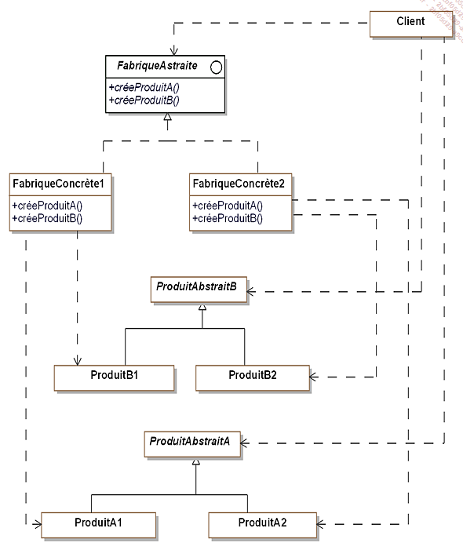

# 1) abstract factory design pattern
 **Problématique** 
 A chaque fois qu'une nouvelle classe véhicule doit etre prise en compte, on doit modifier la classe mère.

 L'abstract factory résoud les problemes de creation de classe dont on ne connait pas le contenu final afin de déresponsabiliser la classe mère.
 Ici utilisation d'une interface qui comprend la signature des méthodes qui permettront de construire chaque produit et de sous-classes fabriqueVehiculeElectrique et fabriqueVehiculeEssence
*def signature = son nom, ses entrées et ses sorties*

### Diagrammes factory   



Description partie scooter : une classe abstraite Scooter, deux classes ScooterElectrique et ScooterEssence qui contiennent les parametres propres à chaque scooter. Pour créer un scooter on passe par ces deux classes filles.

Exemple implémentation :  
```
public abstract class Car {
    protected string model;
    protected string color;
    protected int power;
    protected int space;`
   
   
    protected Car(string model, string color, int power, int space)
    {
        this.model = model;
        this.color = color;
        this.power = power;
        this.space = space;
    }

    public abstract void displayFeatures();
}
 ------------------------------------------------------   

public class ElectricCar : Car
{
    public ElectricCar(string model, string color, int power, int space) : base(model, color, power, space)
    {
    }

    public override void displayFeatures()
    {
        Console.WriteLine("Electric car : ");
        Console.WriteLine("Model : "+model);
        Console.WriteLine("Color : "+color);
        Console.WriteLine("Power : "+power);
        Console.WriteLine("Space: "+space);
    }
}

--------------------------------------------------------  

public interface VehicleFactory {
    public Car buildCar(string model, string color, int power, double space);
    //can implement a second method buildScooter
}

--------------------------------------------------------  

public class ElectricVehicleFactory : VehicleFactory
{
    public Car buildCar(string model, string color, int power, double space)
    {
        return new ElectricCar(model, color, power, space);
    }

    //can implement a second method buildScooter that return an ElectricScooter
}

--------------------------------------------------------  

public class Catalogue {

    public static int vehicleNumber = 3;
    static void Main(string[] args) {
    VehicleFactory factory = new ElectricVehicleFactory();
        Car car = factory.buildCar("Tesla", "blue", 250, 2.5);
        car.displayFeatures();
    
    }
}
````

# 2) builder design pattern
**Problématique**  
Créer un systeme capable de construire une liasse de documents.

But du builder : créer une liasse de document sans connaitre le type de document à l'arrivée.


### Diagrammes builder   


  
NB: le Client ne discute qu'avec le builder de base pour séparer l'implémentation de la routine. 