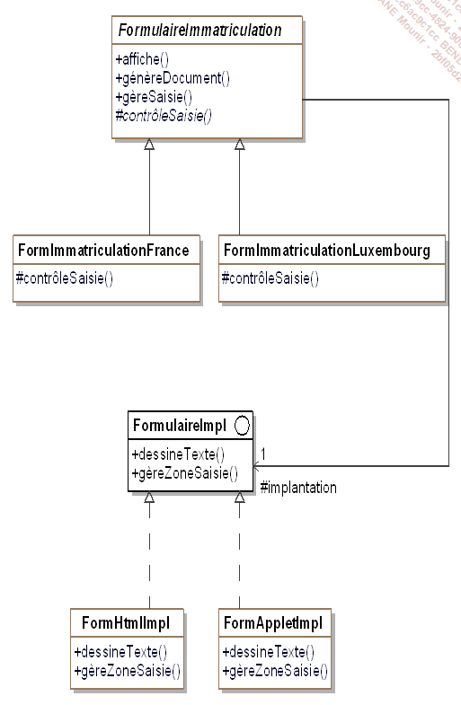
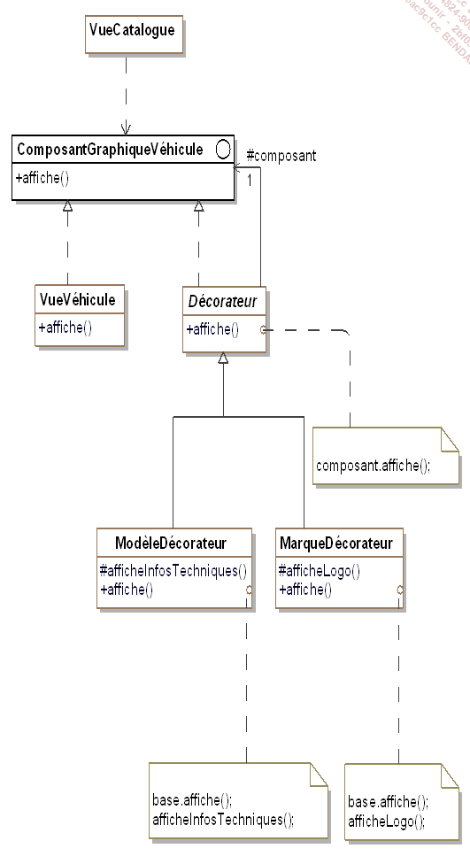
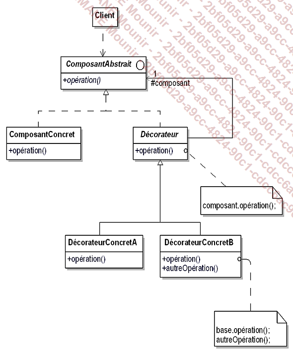

# 1) Adapter

C'est un design pattern qui permet de faire collaborer des objets ayant des interfaces normalement incompatibles.  
**But =>** convertir l'interface d'une classe donnée en une interface attendue par des clients afin qu'ils puissent
travailler ensemble.

DocumentHtml hérite de Document. DocumentPdf hérite de Document et est composé de plusieurs objets ComposantPdf. Dans ce
cas, la classe DocumentPdf adapte ComposantPdf.  
*voir exemple d'implémentation dans dossier Adapter*

# 2) Bridge

Ce pattern est utilisé pour séparer le comportement de l'implémentation de l'interface et de l'objet.  
Dans notre exemple on s'intéresse à la demande d'immatriculation d'une voiture. Le formulaire de demande
d'immatriculation possède deux implémentations différentes :

- FormulaireImmat (abstraite)
- FormulaireImmatHTML/FormulaireImmatAPP

**Probleme**  
Ce système est conçu pour les immatriculations françaises. On souhaite créer une sous classe pour la Suisse (
FormulaireImmatCH) qui sera abstraite et qui doit avoir les deux implémentations.  

*voir exemple d'implémentation dans dossier Bridge*

# 3) Composite

C'est un patron structurel qui permet d'agencer les objets dans des arborescences afin de pouvoir traiter celles ci
comme des objets individuels. Il offre un cadre de conception d'une composition d'objet dont on ne connait pas la
profondeur. les clients interagissent avec les objets sans connaitre la structure de l'arbre.

*voir exemple d'implémentation dans dossier Composite*

# 4) Decorator

Ce pattern permet d'ajouter dynamiquement des fonctionnalités supplémentaires à un objet sans modifier l'interface de l'
objet.  
Il s'agit d'une alternative à la création d'une sous-classe qui permettrait d'enrichir l'objet.

*voir exemple d'implémentation dans dossier Decorator*